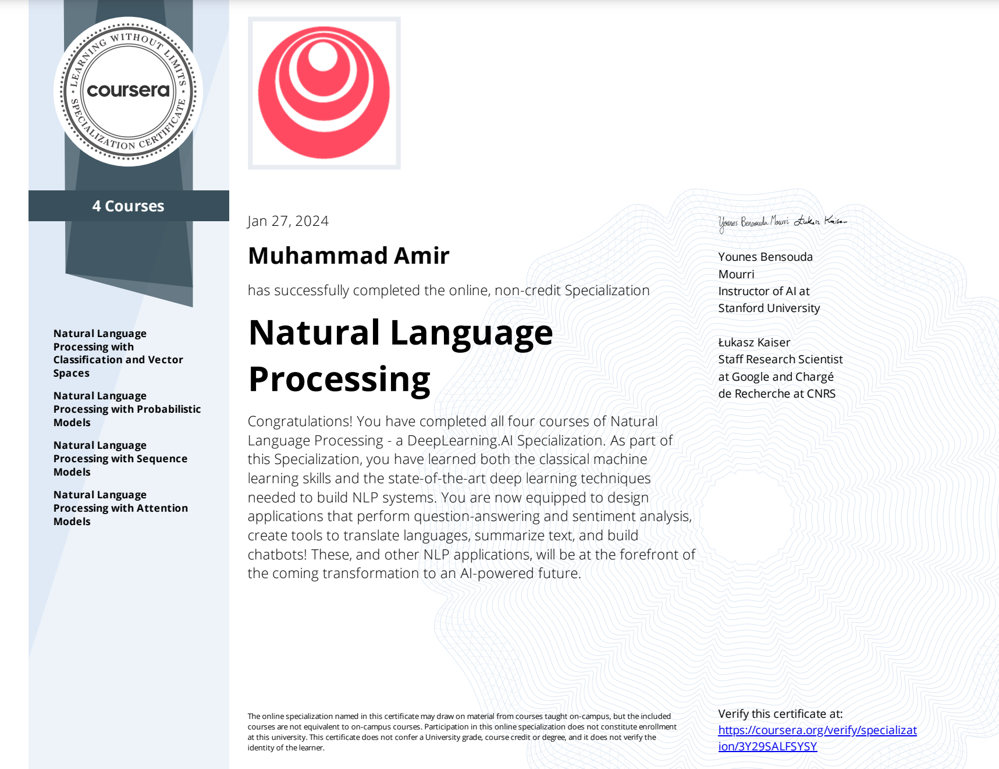

<h2 align="left">Hi World👋! My name is Muhammad Amir</h2>

###

  <!-- GitHub stats card showing total contributions, private commits, and other stats for user "ammyjutt" -->
  

  <!-- Top languages card displaying the most frequently used programming languages for user "ammyjutt" -->

  <!--
  

-->

###

<h3 align="center">Languages and Tools</h3>

  <!-- Added TensorFlow, PyTorch, Langchain, NumPy, Pandas logos with vertical alignment -->
  
  
  
  

  
  <!-- Anaconda Icon -->

<!-- Jupyter Notebook Icon -->

  

  

  
  
  
  
  
  
  
  
  

###

<h3 align="center">Connect with me</h3>

  <!-- Updated contact information -->
  
  

###

 

<h1> Completed Courses & Projects </h1>

I have completed the following specializations from Stanford University and DeepLearning.AI through Coursera:

### 1. Machine Learning Specialization (Total 3 Courses - Approx 2 Months) [Verify Certificate](https://coursera.org/share/ce17284074fe18f6d2ef82c8b2176e7e)
Course 1 - Supervised Machine Learning
Course 2 - Advanced ML Algorithms
Course 3- Unsupervised Machine Learning
-   

### 2. Deep Learning Specialization (Total 5 Courses - Approx 4 Months) [Verify Certificate](https://coursera.org/share/99133df357346e1d48912e0bb2a41094)
Course 4 - Neural Networks and Deep Learning
Course 5 - Hyper-parameters Tuning
Course 6 - Structuring ML Projects
Course 7 - Convolutional Neural Networks
Course 8 - Sequence Models
-   
  

### 3. Natural Language Processing Specialization (4 Courses - Approx 3 Months) [Verify Certificate](https://coursera.org/share/5351448580bf8a4a23cd5b72add8abdc)
Course 9 - NLP with Vector Spaces
Course 10 - NLP with Sequence Models
Course 11 - NLP with Probabilistic Models
Course 12 - NLP with Attention Models
-   

## AI Projects

### 1. CycleGAN Model for Image Translation
- **Description**: A deep learning model implementing CycleGAN for unpaired image-to-image translation tasks.
- **Repository**: [CycleGAN Model for Image Translation](https://github.com/ammyjutt/CycleGAN_Model_For_Image_Translation)

### 2. Aerial Image Segmentation
- **Description**: A project focused on semantic segmentation of aerial imagery using deep learning techniques.
- **Repository**: [Aerial Image Segmentation](https://github.com/ammyjutt/Aerial_Image_Segmentation)

### 3. AI Keep Notes Taking App
- **Description**: An AI-powered note-taking app, designed to help users manage and organize their tasks efficiently.
- **Repository**: [AI Keep Notes Taking App](https://github.com/ammyjutt/AI-Keep-Notes-Taking-App)

### 4. Machine Learning Project: Activity Recognition
- **Description**: A machine learning model for recognizing and classifying human activities based on sensor data.
- **Repository**: [ML Project: Activity Recognition](https://github.com/ammyjutt/ML_Project_Activity_Recognition)

 

  

